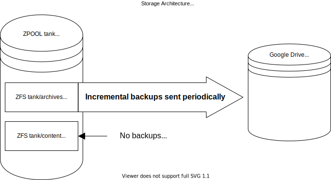
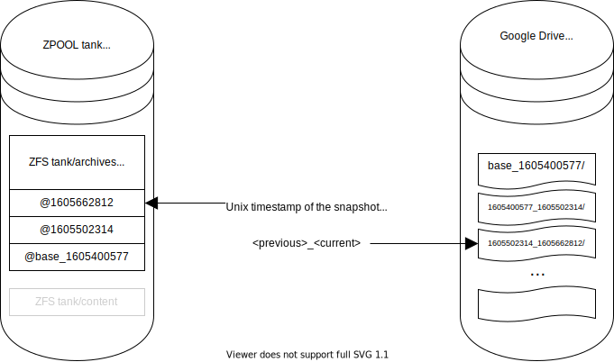
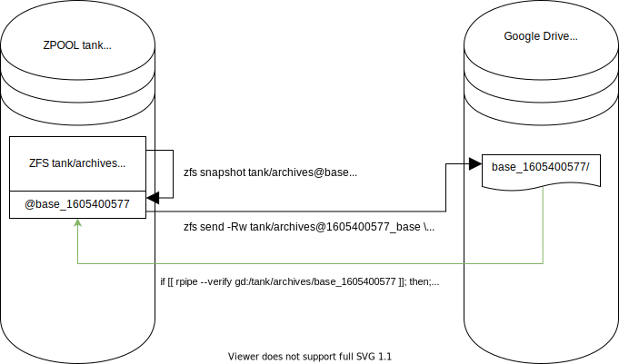
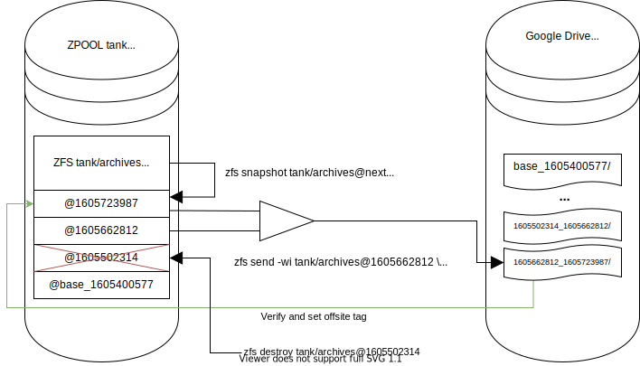

# storage_architecture
Documentation and scripts for my storage and backup system

This storage architecture makes a distinction between archival data, and content. Content is publicly available media and software that can be replaced. Archival data is personal, private, and can not be recovered if lost.

# Internal Architecture
Only the last few periodic snapshots are retained locally, whereas remote storage contains a base file and all period increments going forward.

The @base snapshot is created when the remote storage is first initialized and is not touched again

Every period, a snapshot is created and an increment is sent to the remote storage. The oldest periodic snapshot is destroyed in accordance with the "local snapshots retained" parameter

# Initialization
The dataset is snapshot to @%s_base (where %s is the unix timestamp of the creation date of the snapshot) 

Then a send is executed to send the full replication data stream to a file on the remote

# Incremental Backup
Every period, a new dataset snapshot is created and then the increment between this and the previous snapshot is sent to remote storage. Finally any snapshots past the set number of local snapshots are destroyed (except for the base)

